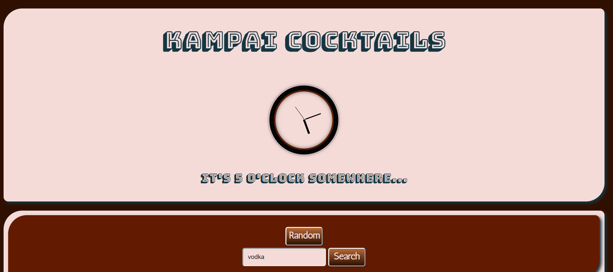
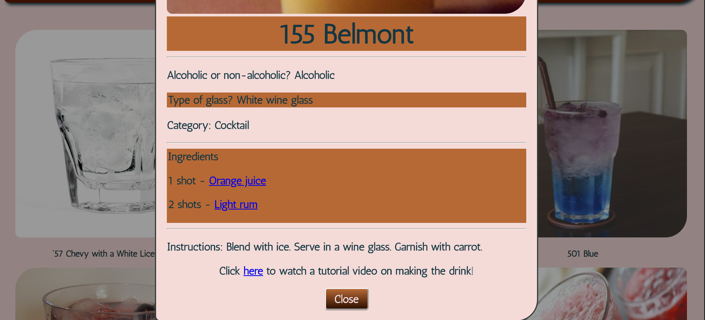

# Kampai Cocktails

(This was created during our time as students at Code Chrysalis.)

On a cold, lonely night, you want to curl up on the sofa and relax with a nice drink...but what should you drink? This app helps you answer that burning question that we all have. You can choose a random drink or search for drinks made with a specific ingredient you may have! Please enjoy, but drink responsibly!

Please drink responsibly at:
[Kampai Cocktails](https://kampai-cocktails.web.app/)

Checkout out our presentation at:
[CC12 Online API Night with Rakuten RapidAPI](https://youtu.be/Qu_bTj7-abY?t=3118)

### Here's a preview of the intro screen:



### This is a preview of the result screen:



## Installation

1. Please clone the repo

2. Install packages

```bash
yarn install
yarn start
```

3.  Find a drink

4.  Have fun!

## Built With

- [React](https://reactjs.org/)
- [Rakuten Rapid API](https://english.api.rakuten.net/)
- [Firebase](https://firebase.google.com/)

## Contributing

Pull requests are welcome. For major changes, please open an issue first to discuss what you would like to change.

## License

[MIT](https://choosealicense.com/licenses/mit/)

## Authors

- [Halee Pagel](https://github.com/haleepagel)
- [Jeff Bentley](https://github.com/jbentleyjp)
- [Tam Nguyen](https://github.com/softwaredeveloptam)
- [Garrett Chun](https://github.com/KapakahiCoder)
